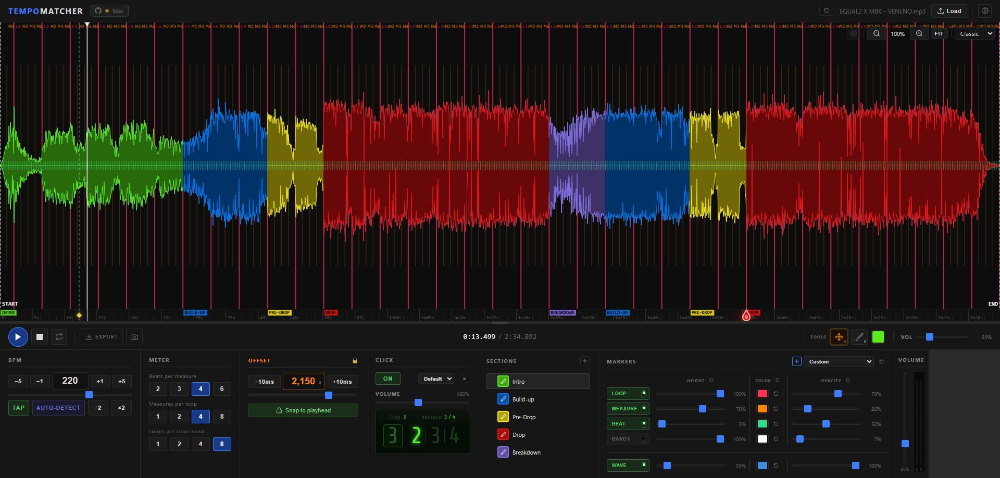
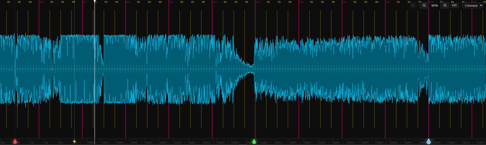
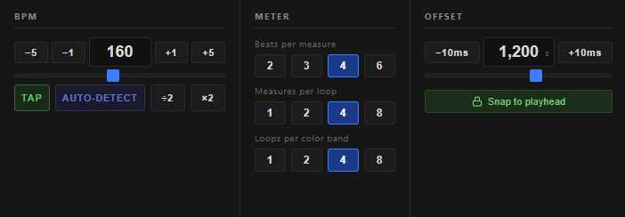
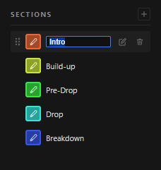
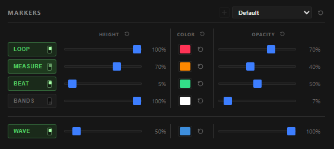
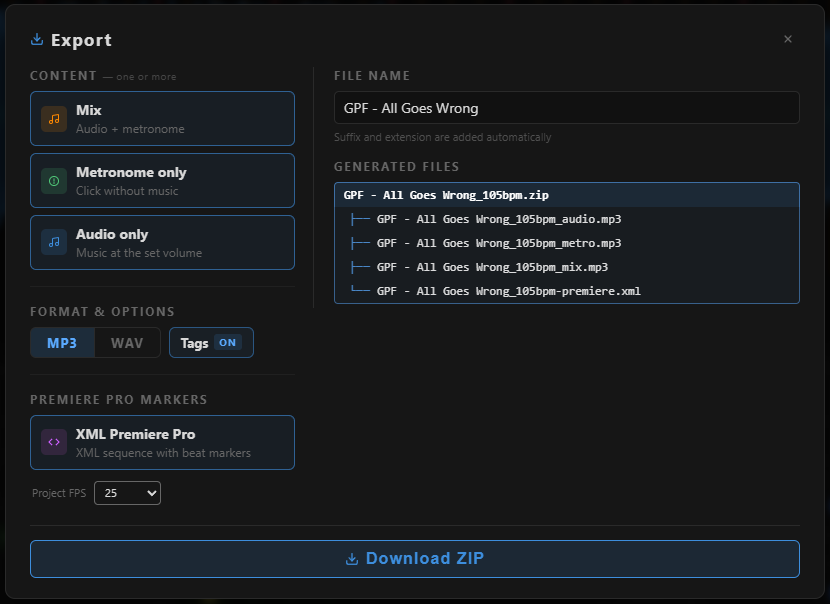

<div align="center">

# TempoMatcher

**Visual beat-grid editor & metronome for audio analysis**

Drop a track. Set the BPM. Align the grid. Export.

[](https://Lotter-35.github.io/TempoMatcher)
&nbsp;
[](LICENSE)
&nbsp;
[](#tech-stack)

</div>

---

<div align="center">



</div>

---

## What it does

TempoMatcher lets you load any audio file and overlay a precise beat grid on top of the waveform — then export the result as audio (with or without a metronome click) or as an Adobe Premiere Pro XML marker file.

It was designed for **musicians, producers, DJs and video editors** who need to:
- visually verify or correct the timing of a track
- generate a click track to accompany a recording
- create Premiere Pro beat markers for music-video editing
- organize a track into color-coded sections (verse, chorus, break…)

No install. No account. Everything runs in the browser and your data stays local.


🌐 **[Access the app online → TempoMatcher](https://Lotter-35.github.io/TempoMatcher)**

---

## Features

### 🎧 Audio playback
- Drag & drop **or** file picker — MP3, WAV, OGG, FLAC, AAC, M4A
- Play / Pause / Stop, loop mode, seek by clicking the waveform or ruler
- Main volume slider (0–400%) + real-time **VU meter**
- All settings auto-saved per track name in `localStorage`

### 🌊 Waveform canvas

<div align="center">



</div>

- **Classic mode** — min/max peaks (multi-channel mixdown)
- **Spectral mode** — colour spectrogram (bass / mid / high)
- Scroll-wheel or button zoom, drag/middle-click pan, **auto-follow** playhead
- Resizable waveform height via drag handle
- HiDPI rendering (`devicePixelRatio` scaling)

### 🥁 Beat grid & metronome

<div align="center">



</div>

| Control | Details |
|---|---|
| **BPM** | Slider 20–320, numeric input, ±1 / ±5 nudge, tap tempo, one-click auto-detect |
| **Time signature** | Beats per measure (2/3/4/6), measures per loop, loops per colour band |
| **Offset** | Shift the grid by milliseconds; snap to playhead in one click |
| **Pin markers** | Place markers on the ruler; lock the grid to a pin so BPM edits stay aligned |
| **Metronome click** | 5 sound profiles, independent volume, preview without playback |
| **Beat counter** | Live loop / measure display with per-beat flash |

### 🎨 Section painter




- Activate with **B** — paint individual measures by dragging
- Right-click to erase; **Ctrl+Z / Ctrl+Y** for undo/redo
- Named colour palette — add, rename, delete entries
- All sections saved per track

### 📐 Marker layers





Five independent layers: **Loop · Measure · Beat · Bands · Waveform**

Each layer has its own:
- Visibility toggle
- Height slider
- Colour picker + reset
- Opacity slider + reset

**Visual profiles** — 5 built-in presets (Default, Nocturne, Vivid, Pastel, Monochrome) + unlimited custom profiles saved to `localStorage`. Profiles can be renamed, duplicated or deleted.

### 📤 Export



**Audio export (MP3 / WAV)**
- Three render modes: audio only · metronome only · mixed (audio + click)
- Batch render — select multiple modes and download as a single ZIP
- File names are auto-generated: `trackname_120bpm_mix.mp3`
- Offline render via `OfflineAudioContext` — no real-time wait

**Premiere Pro XML**
- XMEML v4 sequence with Loop (red), Measure (orange) and Beat (green) markers
- Select your project frame rate (23.976 → 60 fps, NTSC drop-frame auto-detected)

**PNG snapshot**
- Export the current waveform view as a high-resolution PNG (1× or 2× scale)

### 🌐 Internationalisation

- Four languages: **English · Français · Deutsch · Español**
- Language selector in the settings gear menu (top right)
- Language persisted across sessions
- Canvas labels (START/END, loop/measure prefixes) adapt to the selected language

### 💾 Persistence & panels
- All per-track settings (BPM, offset, sections, pins, marker styles) saved automatically
- Resizable panels — drag the dividers to resize; all widths saved
- Drag-and-drop panel reordering
- **Reset track** button — clears all saved data for the current file

---

## Getting started

```
git clone https://github.com/Lotter-35/TempoMatcher.git
cd TempoMatcher
# Open index.html in any modern browser — no build step needed
```

Or use the **[live version](https://Lotter-35.github.io/TempoMatcher)** directly.

### Quick workflow

1. **Drop an audio file** onto the waveform (or click **Load**)
2. **Set the BPM** — use the slider, tap tempo, or hit **Auto-Detect**
3. **Match the grid** — adjust beats per measure and use the Offset slider (or *Snap to playhead*) until the grid lines up with the transients
4. **Paint sections** (optional) — press **B**, choose a colour and drag across the waveform
5. **Tweak marker styles** (optional) — adjust layer heights, colours and opacities in the Markers panel
6. **Export** — click **EXPORT** for audio/ZIP, or use the XML button for Premiere Pro markers

### Keyboard shortcuts

| Key | Action |
|---|---|
| `Space` | Play / Pause |
| `S` | Stop |
| `B` | Brush tool |
| `H` / `Escape` | Pan tool |
| `+` / `-` | Zoom in / out |
| `F` | Zoom to fit |
| `←` / `→` | Seek ±1 s |
| `Shift + ←/→` | Seek ±5 s |
| `Ctrl+Z` / `Ctrl+Y` | Undo / Redo (brush) |

---

## Project structure

```
TempoMatcher/
├── index.html          # Layout & all UI markup
├── style.css           # Single dark-theme stylesheet
└── js/
    ├── metronome.js    # Look-ahead metronome (Web Audio API)
    ├── waveform.js     # Canvas renderer — waveform, spectrogram, markers, brush
    ├── audio.js        # Audio engine — decoding, playback, VU metering
    ├── export.js       # Export engine — MP3/WAV render, ZIP, XML, PNG
    ├── i18n.js         # Internationalisation module (EN/FR/DE/ES)
    └── app.js          # Main controller — UI wiring, persistence, resize
```

## Tech stack

| Area | Technology |
|---|---|
| Rendering | Canvas 2D API |
| Audio | Web Audio API + OfflineAudioContext |
| ZIP | [JSZip](https://stuk.github.io/jszip/) (CDN, no install) |
| Framework | None — vanilla JS, no build step |
| Storage | `localStorage` |

---

## License

MIT © [Lotter-35](https://github.com/Lotter-35)
